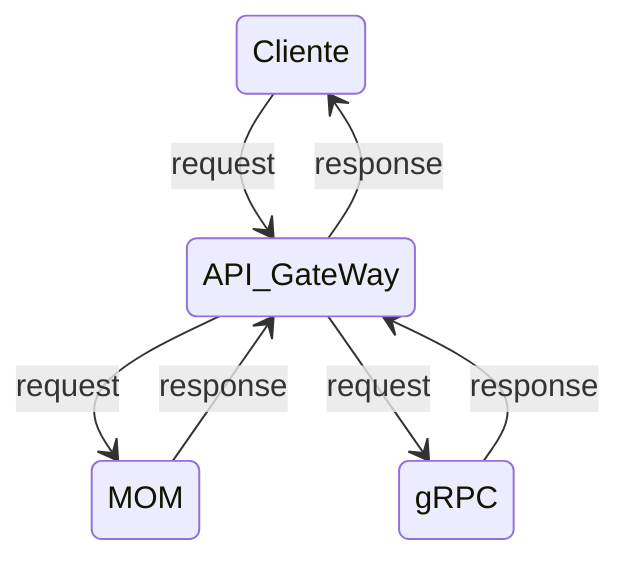

## ST0263 Tópicos especiales en telemática

**Juan David Valencia Torres, [jdvalencit@eafit.edu.co](mailto:jdvalencit@eafit.edu.co)**

**Edwin Nelson Montoya Munera,** [emontoya@eafit.edu.co](mailto:emontoya@eafit.edu.co)

## Laboratorio de implementación de MOM y gRPC

### 1. Descripción de la Actividad

En el reto se diseñó e implementó una API Gateway utilizando fastAPI, que se integró con dos microservicios: uno implementado en gRPC y el otro en RabbitMQ. La API Gateway se configuró para enrutar las solicitudes recibidas a los microservicios correspondientes permitiendo que los clientes de la API interactúen con ambos microservicios a través de una sola interfaz.

Para integrar el servicio gRPC con la API Gateway, se creó y configuró un cliente gRPC con sus respectivos protobuffers para establecer una comunicación estable con el servidor gRPC ubicado en el microservicio.

Por otro lado, para integrar el servicio RabbitMQ con la API Gateway, se creó un cliente rpc que permitió la comunicación entre la API Gateway y el servicio RabbitMQ, para establecer la comunicación con el microservicio.

### 1.1. Aspectos cumplidos

- La API Gateway debe ser capaz de enrutar las solicitudes recibidas a los microservicios usando balanceo de carga.
- La API Gateway debe ser capaz de integrarse con dos microservicios diferentes: uno implementado en gRPC y otro en RabbitMQ.
- La API Gateway debe ser capaz de listar los archivos que se encuentran en una carpeta especificada en la configuración, esto implementados en ambos microservicios.
- La API Gateway debe ser capaz de buscar un archivo concreto en una carpeta especificada en la configuración, esto implementados en ambos microservicios.
- Tanto la API Gateway como los dos microservicios deben soportar múltiples peticiones simultaneas y dar respuesta a todas ellas.

### 2. Estructura de la aplicación



### 3. Ambiente de desarrollo

**3.1. A continuación se presenta la lista de las tecnologías usadas para el desarrollo del reto:**

- pyhton, versión: 3.11.2,
- fastAPI, versión: 0.92.0
- pika, versión: 1.3.1
- grpcio, versión: 1.51.3
- uvicorn, versión: 0.20.0
- nginx, versión: 1.18.0
- rabbitMQ, versión: 3.9.13

**3.2 Compilación y ejecución**

Al ser desarrollado en python no se debe compilar ningún archivo, solo se debe correr el archivo [start.sh](http://start.sh) presente en /home/ubuntu

```bash
/home/ubuntu:~$ ./start.sh
```

Este archivo se encarga de activar todos los recursos y necesarios para la correcta ejecución del proyecto.

**3.3 Configuración**

**************************************************Conifguración principal:************************************************** el proyecto cuenta con un archivo config.json ubicado en la carpeta principal del proyecto ([ch2-mom-grcp/config.json](https://github.com/jdvalencit/jdvalencit-st0263/blob/main/ch2-mom-grcp/config.json)****)****

```json
{
    "dir_path": "/home/ubuntu/jdvalencit-st0263/ch2-mom-grcp/microservices/files",

    "mom_client_host":"localhost",
    "mom_client_port":5672,
    "mom_server_host":"localhost",
    "mom_server_port":5672,

    "grpc_client_host":"localhost",
    "grpc_client_port":"50051",
    "grpc_server_host":"[::]",
    "grpc_server_port":"50051",
    "grpc_workers":10
}
```

Este archivo de configuración cuenta con la dirección de los archivos con los cuales se realizarán las funciones establecidas en la API GateWay, también cuenta con todos los hosts y puertos necesarios para la conexión de los clientes y los servidores tanto de gRPC y de RPC por medio de RabbitMQ.

********************Configuración Nginx:******************** adicionalmente, el proyecto también cuenta con un archivo de configuración de nginx en la dirección `/etc/nginx/sites-enabled/fastapi_nginx`

```json
server {
        listen 80;
        server_name 52.203.226.106;
        location / {
                proxy_pass http://127.0.0.1:8000;
        }
}
```

Este archivo de configuración se encarga de utilizar nginx para escuchar las peticiones en el puerto 80 de la dirección IP 52.203.226.106 y enviarlas al puerto 8000 de la IP 127.0.0.1 (localhost) donde se encuentra nuestra API GateWay

**3.4 Estructura completa de directorios**


### 4. IP del proyecto

Para el desarrollo del proyecto se hizo uso de una ip eslástca otorgada por AWS para así mantener una consistencia en cuanto la ip usada para acceder a la api.

**4.1 Proyecto en ejecución**

Si llamamos el servicio con la url:

```bash
http://52.203.226.106/list
```

La API GateWay nos dirigirá a uno de los microservicios para obtener respuesta de nuestra petición

```json
["method: MOM ","dir: /home/ubuntu/jdvalencit-st0263/ch2-mom-grcp/microservices/files","files: ['file2.txt', 'file3.txt', 'file1.txt']","dir: /home/ubuntu/jdvalencit-st0263/ch2-mom-grcp/microservices/files/newfiles","files: ['nf5.txt', 'nf4.txt']"]
```

Un posible resultado a una petición list es la anterior, cuenta con el método usado para obtener respuesta, ya sea por medio del MOM o por medio de gRPC y la información de los directorios y archivos presentes. 

### 5. Guía de uso

La API GateWay expone dos funciones para los usuarios, list y search.

- [http://52.203.226.106/list](http://52.203.226.106/list): Esta función lista todos los archivos y directorios que se encuentren en el directorio path_dir de la configuración.
- [http://52.203.226.106/search/{nombre del archivo a buscar}/](http://52.203.226.106/list): Esta función busca el archivo especificado en directorios que se encuentren en el directorio path_dir de la configuración.

### Referencias:

- Tutorial de RabbitMQ: [https://www.rabbitmq.com/tutorials/tutorial-six-python.html](https://www.rabbitmq.com/tutorials/tutorial-six-python.html)
- Configuración de nginx para el despliegue de la api: [https://www.youtube.com/watch?v=SgSnz7kW-Ko](https://www.youtube.com/watch?v=SgSnz7kW-Ko)
- Guía en python de gRPC: [https://grpc.io/docs/languages/python/quickstart/](https://grpc.io/docs/languages/python/quickstart/)

V**ersión [README.md](http://readme.md/) -> 1.0 (2023-Marzo)**
