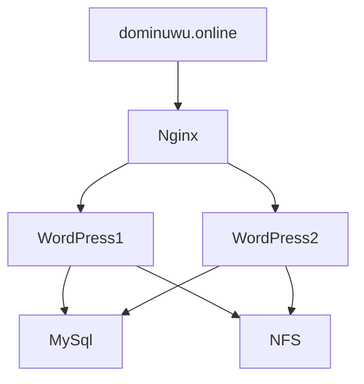

## ST0263 Tópicos especiales en telemática

**Juan David Valencia Torres, [jdvalencit@eafit.edu.co](mailto:jdvalencit@eafit.edu.co)**

**Edwin Nelson Montoya Munera,** [emontoya@eafit.edu.co](mailto:emontoya@eafit.edu.co)

## Laboratorio despliegue de WordPress, NFS, MySql y Nginx

### 1. Descripción de la Actividad

En el reto se diseñó y desplegó una apliación de wordpress distribuida en dos instancias diferentes compartiendo base de datos y servidor nfs. Se integró Nginx para servir de proxy inverso y balanceador de carga entre las dos instancias y permitir el acceso a las mismas desde el dominio: [dominuwu.online](http://dominuwu.online) contando con los certificados necesarios para permitir la navegación a través de https.

### 1.1. Aspectos cumplidos

- Servidor NFS disponible para dos instancias de wordpress.
- Implementación de MySql como base de datos para alojar los datos de las dos instancias de wordpress.
- Dos instancias de wordpress apuntando hacia el mismo servidor NFS y base de datos MySQL.
- Implementar una instancia con Nginx para servir de proxy inverso y balanceador de carga entre las dos instancias de wordpress.
- Obtener un dominio para acceder a la página por medio de él.
- Obtener certificados para el dominio para permitir el acceso a la página por medio de https.

### 2. Estructura de la aplicación




### 3. Ambiente de desarrollo

**3.1. A continuación se presenta la lista de las tecnologías usadas para el desarrollo del reto:**

- docker, versión: 20.10.21
- docker-compose, versión: 1.29.2
- MySql docker image, versión: 5.7
- nfs-kernel-server, versión: 1.3.4-2
- nfs-common, versión: 2.6.1
- nginx, versión: 1.18.0
- certbot, versión: 1.21.0

**3.2 Compilación y ejecución**

Para la ejecución de este reto se deben seguir los siguientes pasos:

1. Iniciar las instancias nfs y mysql.
2. En la instancia mysql correr el siguiente comando para iniciar docker con MySql:

```bash
sudo docker-compose -f docker-compose.yml up
```

1. Iniciar las instancias wp1 y wp2 y correr el siguiente comando para iniciar docker con wordpress:

```bash
sudo docker-compose -f docker-compose.yml up
```

1. Iniciar la instancia nginx
2. Entrar al dominio [dominuwu.online](http://dominuwu.online) 

**3.3 Configuración**

**Conifguración principal:** 

1. NFS host: [nfs-host-config](https://github.com/jdvalencit/jdvalencit-st0263/blob/main/ch3-distributed-wordpress/nfs/nfs-host-config.txt)

```
1. Instalamos el nfs server
    $ sudo apt install nfs-kernel-server

2. Creamos el directorio a compartir
    $ sudo mkdir /var/nfs/general -p

3. Cambiamos la propiedad del directorio al grupo novody:nogroup
    $ sudo chown nobody:nogroup /var/nfs/general
    
4. Editamos el archivo /etc/exports para exportar el nfs añadiendo las siguientes entradas:
    /var/nfs/general    10.128.0.3/16(rw,sync,no_root_squash,no_subtree_check)
    /var/nfs/general    10.128.0.5/16(rw,sync,no_root_squash,no_subtree_check)

5. Reiniciamos el nfs server
    $ sudo systemctl restart nfs-kernel-server
```

1. NFS client: [nfs-client-config](https://github.com/jdvalencit/jdvalencit-st0263/blob/main/ch3-distributed-wordpress/wordpress/nfs-client-config.txt)

```
1. Instalamos el cliente de nfs
    $ sudo apt install nfs-common

2. Creamos el directorio para montar el nfs
    $ sudo mkdir -p /mnt/wordpress

3. Montamos el directorio del host de nfs con el directorio que acabamos de crear
    $ sudo mount 10.128.0.2:/var/nfs/general /mnt/wordpress

4. Editamos el archivo /etc/fstab para que el montaje se realice automáticamente al iniciar la instancia
    10.128.0.2:/var/nfs/general    /mnt/wordpress   nfs auto,nofail,noatime,nolock,intr,tcp,actimeo=1800 0 0
```

1. MySql: [docker-compose.yml](https://github.com/jdvalencit/jdvalencit-st0263/blob/main/ch3-distributed-wordpress/mysql/docker-compose.yml)

```yaml
version: '3.1'
services:
  db:
    image: mysql:5.7
    restart: always
    ports:
      - 3306:3306
    environment:
      MYSQL_DATABASE: wpdb
      MYSQL_USER: admin
      MYSQL_PASSWORD: admin
      MYSQL_RANDOM_ROOT_PASSWORD: '1'
    volumes:
      - db:/var/lib/mysql
volumes:
  db:
```

1. WordPress: [docker-compose.yml](https://github.com/jdvalencit/jdvalencit-st0263/blob/main/ch3-distributed-wordpress/wordpress/docker-compose.yml)

```yaml
version: '3.1'
services:
  wordpress:
    container_name: wordpress
    image: wordpress
    ports:
      - 80:80
    restart: always
    environment:
      WORDPRESS_DB_HOST: 10.128.0.4
      WORDPRESS_DB_USER: admin
      WORDPRESS_DB_PASSWORD: admin
      WORDPRESS_DB_NAME: wpdb
    volumes:
      - /mnt/wordpress:/var/www/html
```

1. Nginx: [nginx.conf](https://github.com/jdvalencit/jdvalencit-st0263/blob/main/ch3-distributed-wordpress/nginx/nginx.conf)

```llvm
http {
  upstream wordpress {
    server 10.128.0.3;
    server 10.128.0.5;
  }

  server {
    listen 80;
    server_name dominuwu.online;
    return 301 https://$host$request_uri;
  }

  server {
    listen 443 ssl;
    server_name dominuwu.online;

    ssl_certificate /etc/letsencrypt/live/dominuwu.online/fullchain.pem;
    ssl_certificate_key /etc/letsencrypt/live/dominuwu.online/privkey.pem;

    location / {
      proxy_pass http://wordpress;
      proxy_set_header Host $host;
      proxy_set_header X-Real-IP $remote_addr;
      proxy_set_header X-Forwarded-For $proxy_add_x_forwarded_for;
    }
  }
}
```

**3.4 Estructura completa de directorios**


### 4. IP del proyecto

Para el desarrollo del proyecto se hizo uso de cinco ips estáticas privadas para cada una de las instancias y una ip estática pública para la conexión entre la instancia de nginx y el dns del dominio.

### 5. Guía de uso

Si entramos a `https://dominuwu.online`tendrémos acceso a la página de wordpress desplegada en las dos instancias.


### Referencias:

- How To Set Up an NFS Mount on Ubuntu 22.04: [https://www.digitalocean.com/community/tutorials/how-to-set-up-an-nfs-mount-on-ubuntu-22-04](https://www.digitalocean.com/community/tutorials/how-to-set-up-an-nfs-mount-on-ubuntu-22-04)
- Nginx Beginner’s Guide: [https://nginx.org/en/docs/beginners_guide.html](https://nginx.org/en/docs/beginners_guide.html)
