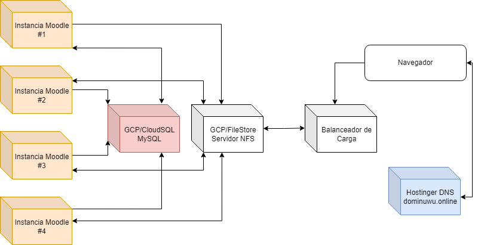
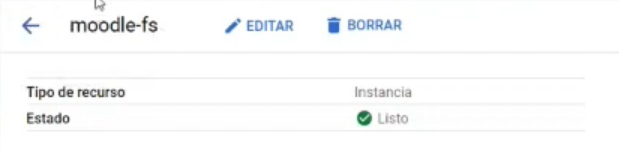
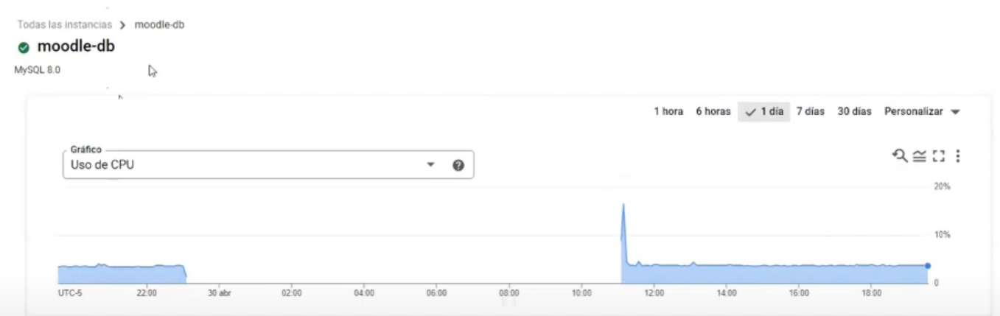
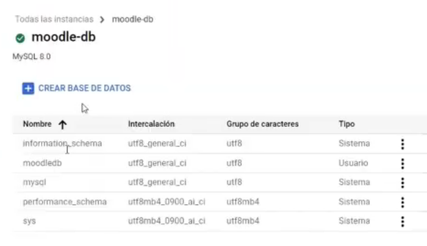
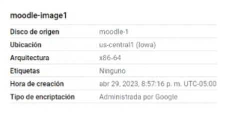
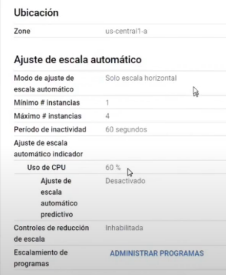
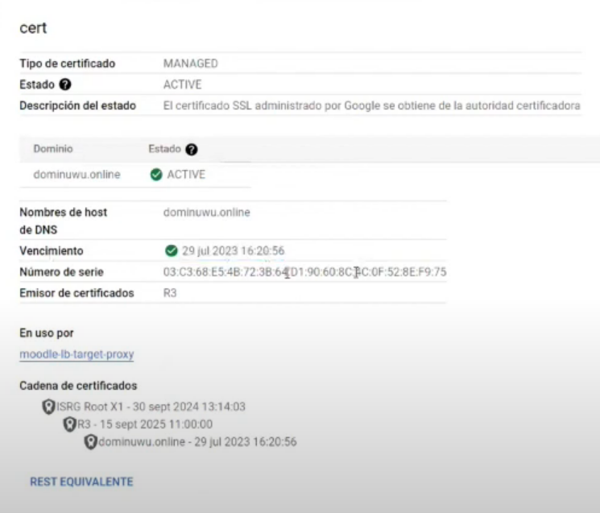

## ST0263 Tópicos especiales en telemática
```
Presentado por:
- Juan David Valencia Torres, [jdvalencit@eafit.edu.co](mailto:jdvalencit@eafit.edu.co)
- David Cardona Nieves, [djcardonan@eafit.edu.co](mailto:djcardonan@eafit.edu.co)

Presentado a:
- Edwin Nelson Montoya Múnero, [emontoya@eafit.edu.co](mailto:emontoya@eafit.edu.co)
```

## 1) Descripción

Este reto consistió en el despliegue de Moodle utilizando servicios de Google Cloud Platform (GCP). Entre las herramientas utilizadas encontramos:

- [x] Balanceador de carga.
- [x] Servidor NFS usando Filestore.
- [x] Base de datos (MySQL) usando Cloud SQL. 

Este despliegue se realizó cumpliendo con los siguientes requisitos propuestos:

- [x] Balanceo de carga entre un grupo de instancias utilizando Load Balancer de GCP.
- [x] Certificación SSL para el dominio **dominuwu.online**.
- [x] Manejo de DNS mediante el DNS ofrecido por el host (Hostinger).  
- [x] Despliegue de un servidor NFS utilizando FileStore de GCP.
- [x] Despliegue de una base de datos MySQL utilizando CloudSQL de GCP.
- [x] Capacidad para autoescalar instancias según la carga.

## 2) Arquitectura

La arquitectura propuesta se compone por máximo 4 instancias de Moodle que conectándose tanto a la base de datos como a la instancia NFS permiten a un cliente que
se conecta por medio de un navegador web visualizar el aplicativo de Moodle accediendo al dominio [dominuwu.online](http://dominuwu.online/).

A continuación se presenta el diseño implementado para esta arquitectura:



## 3) Entorno de desarrollo

Este reto fué desarrollado bajo los siguientes lineamientos:
- Versión Ubuntu: 22.04
- Versión MySQL: 8.0
- Versión Docker: 20.10.21
- Versión Docker-compose 1.29.2
- Versión Nfs-common: 2.6.1

## 4) Detalles de implementación

### 4.1) Servidor NFS (Network File System)

Para el servidor NFS decidimos implementar el servicio de FileStore ofrecido por GCP. Las instancias de Filestore son servidores de archivos NFS completamente administrados
en Google Cloud para usarlos con aplicaciones que se ejecutan en instancias de máquinas virtuales (VM) de Compute Engine o clústeres de Google Kubernetes Engine.

Además de utilizar el paquete **nfs-common** creamos el archivo **fstab** para permitir que las instancias realicen el montaje del NFS de forma autónoma cada vez que son iniciadas.



### 4.2) Base de datos MySQL

Para la base de datos utilizamos CloudSQL donde creamos una instancia llamada "moodle db". Dentro de esta instancia creamos la base de datos asignándole el mismo nombre (moodledb).
Para esta mantuvimos el usuario por default, es decir, el usuario **root*.




### 4.3) Imagen de la máquina virtual y plantilla de la instancia

Una imagen es una instantánea o copia de seguridad de una instancia de máquina virtual (VM) en GCP. Esta imagen puede utilizarse para crear una nueva instancia de VM con la misma configuración
y aplicaciones que la instancia original. En nuestro caso creamos la imagen moodle-image1.



Una plantilla de instancia de GCP (Google Cloud Platform) es una plantilla preconfigurada que se utiliza para crear múltiples instancias de máquinas virtuales (VM) con la misma configuración
y especificaciones. En este caso creamos el template moodle-template tomando a la imagen moodle-image1 como base.

### 4.4) Grupo de instancias

Los grupos de instancias nos permiten proporcionar al sistema escalabilidad automática y alta disponibilidad al distribuir la carga de trabajo en múltiples instancias (en nuestro caso, desde
un mínimo de 1 instancia y un máximo de 4). En nuestro caso creamos el grupo **moodle-group** siguiendo la plantilla moodle-template. Este grupo cuenta con autoescalado horizontal que le permite
añadir nuevas instancias una vez que se llega a un techo de uso de CPU (siendo este de alrededor del 60%).



### 4.5) DNS

Conservamos el DNS ofrecido por el host utilizado para el dominio, es decir, Hostinger. Para la configuración de este pusimos el registro tipo A apuntando a la IP externa de nuestro balanceador
de carga.


### 4.6) Certificados SSL y dominio

El dominio utilizado es [dominuwu.online](http://dominuwu.online/)



### 4.7) Balanceador de carga

Para el balanceador de carga establecimos una división en 2 "secciones", siendo estas el backend y el frontend, de forma que:

- **Backend:** está conformado por el grupo de instancias que reciben el tráfico de red del balanceador de carga. Es decir, es el destino final de las solicitudes que son recibidas y procesadas
por el balanceador de carga. Para esto se creó un servicio de backend llamado moodle-service que toma el moodle-group y permite el balanceo de la carga entre las instancias activas de este grupo.
De igual forma este cuenta con un estado de verificación llamado moodle-state.
- **Frontend:** está conformado por la interfaz de red a través de la cuál el balanceador de carga recibe y procesa el tráfico de los clientes. Es decir, es el punto de entrada de las
solicitudes que son recibidas desde la red externa al sistema.

Configuramos la IP estática 34.149.194.81 con el protocolo HTTPS y un certificado SSL llamado cert obtenido a partir de las herramientas de Certificate Manager de GCP.

## 5) Video demo explicando la implementación

El video explicando la implementación realizada con mayor detalle puede encontrarse en [este](https://youtu.be/c7z9dO0SI5Y) link.

## 6) Referencias

- https://cloud.google.com/load-balancing/docs/https/setting-up-https
- https://certbot-dns-google.readthedocs.io/en/stable/#credentials
- https://cloud.google.com/compute/docs/instance-groups
- https://cloud.google.com/compute/docs/instance-templates
- https://cloud.google.com/compute/docs/instance-templates/create-instance-templates
